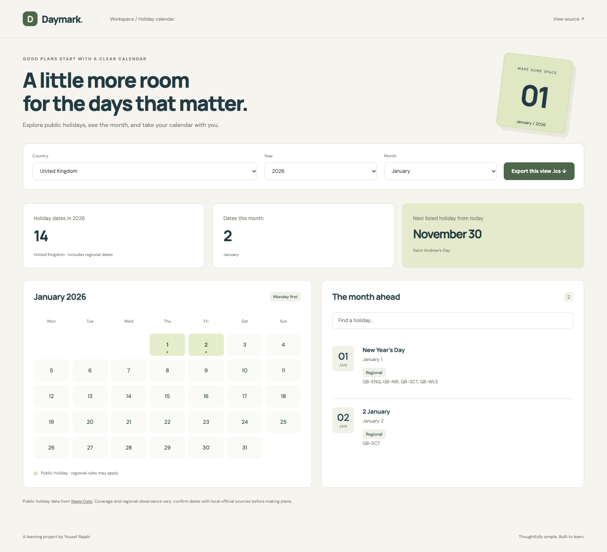

# Daymark Calendar

A public-holiday explorer with a monthly calendar and downloadable calendar events.

**A junior-level, AI-assisted portfolio learning project by Yousef Rajabi.**

## Screenshot



[Mobile screenshot](docs/screenshots/mobile.png) · [Learning guide](docs/LEARNING.md) · [Checks](https://github.com/yousefrajabi06-debug/daymark-calendar/actions)

Screenshots show the running application with public Nager.Date holiday data. They are not design mockups.

## Live Demo

[Open Daymark Calendar](https://yousef-daymark.netlify.app/)

Uses the public Nager.Date API. Country coverage and regional observance vary; verify important dates with official local sources.

## Why this project

Adds date handling, request cancellation, regional API data, and file export rather than another weather or media-search app.

## Features

- Choose a country, year, and month using the Nager.Date public API.
- See holiday markers in a Monday-first monthly calendar.
- Search holiday names and distinguish nationwide from regional dates.
- Export the filtered holiday list as an all-day .ics calendar.
- Show loading, request errors, retry controls, and empty results.
- Cancel outdated requests and stop requests after a 12-second timeout.

## Tech Stack

React 19, JavaScript, Fetch API, AbortController, Intl, Vite, CSS, Playwright.

## Installation

Use **Node.js 24+** and npm. Install dependencies from the project directory:

```bash
git clone https://github.com/yousefrajabi06-debug/daymark-calendar.git
cd daymark-calendar
npm install
npm run dev
```

Open the local Vite URL printed in the terminal (normally http://127.0.0.1:5173).

No secret API keys are required. Never put credentials in frontend code. Dependencies are locked in `package-lock.json`; use `npm ci` for a reproducible clean install.

## Production build

```bash
npm run build
npm run preview
```

The build output is `dist/`. Preview is a local build check, not a hosted production service.

## Tests

```bash
npx playwright install chromium
npm test
```

If Chrome is already installed locally, macOS/Linux users can instead run `PLAYWRIGHT_CHANNEL=chrome npm test`. Browser tests use local development servers. GitHub Actions performs `npm ci`, builds the project, installs Chromium, and runs the tests on pushes and pull requests.

Three browser tests use mocked API responses to verify selection, search, regional labels, ICS export, loading, retry behavior, and mobile layout.

## Source organization

- [`src/App.jsx`](src/App.jsx): Country/year/month controls and request lifecycles.
- [`src/components/Calendar.jsx`](src/components/Calendar.jsx): Month grid, weekday offset, and holiday markers.
- [`src/lib/holidays.js`](src/lib/holidays.js): Fetch wrapper, data validation, date formatting, and ICS export.
- [`tests/app.spec.js`](tests/app.spec.js): Deterministic API fixtures, retry behavior, controls, export, and mobile layout.

## What I Learned

This AI-assisted implementation provides practice with the following concepts. These are study outcomes to work through, not a claim that every line was written independently:

- Trace async/await and the difference between network errors and HTTP errors.
- Explain useEffect cleanup and why an old response must not overwrite a new selection.
- Calculate the weekday offset for a Monday-first calendar.
- Understand all-day events and the exclusive end date in ICS.
- Use browser test route fixtures to test a remote API failure predictably.

See [the learning guide](docs/LEARNING.md) for an independent feature exercise and a rebuild plan.

## Limitations and data

Requires internet and Nager.Date availability. No API key is required. Coverage differs by country, and regional holidays are not applicable everywhere. Verify dates with official local sources before making plans. The next-holiday card uses today, while the month list follows the selected month. Calendar integration beyond the generated ICS has not been tested across all calendar clients.

The responsive UI includes visible keyboard focus and labeled controls. Browser tests are useful regression checks; they are not a complete accessibility audit. No private personal data, real credentials, generated databases, or `.env` files are committed. External Google Fonts are optional cosmetic requests; system font fallbacks keep the interface usable if fonts are unavailable.

## Future Improvements

- Save the last selected country and month.
- Add region-specific filtering and richer calendar import compatibility.
- Add keyboard navigation between dates and an offline cache.

## Authorship and AI assistance

Created for Yousef Rajabi's student portfolio with AI assistance in planning, implementation, testing, and documentation. Original project code was built for this portfolio; it was not copied from another GitHub application. Third-party libraries remain credited through the Tech Stack and dependency files. This is learning work, not paid client work or invented professional experience.

Public holiday data: [Nager.Date](https://date.nager.at/). Country and holiday data belong to that service; API coverage and availability can change. Automated tests use small invented fixtures so CI does not depend on the live service.
